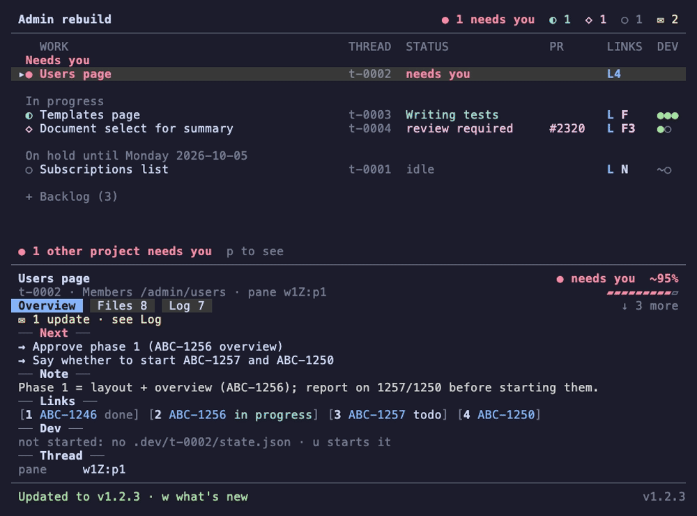
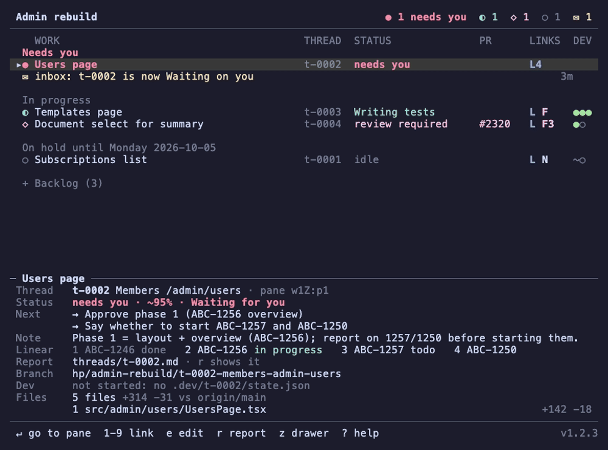
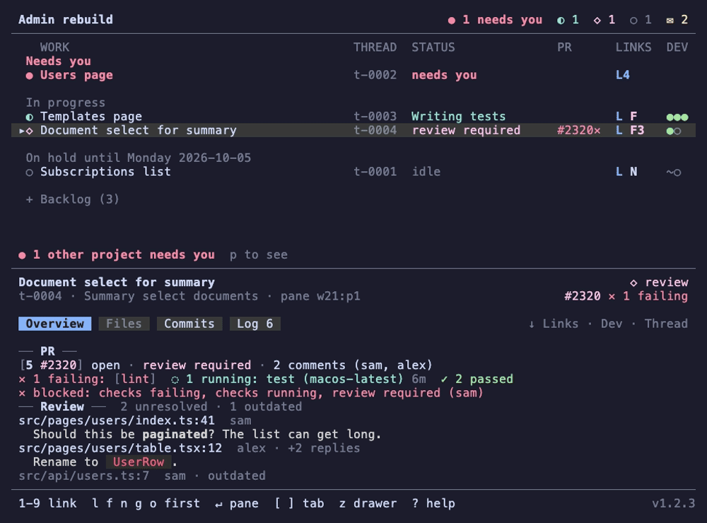

# herdr-deck

[](https://github.com/FredricW/herdr-deck/actions/workflows/ci.yml)

A status pane for [herdr-projects](https://github.com/eliasstravik/herdr-projects):
a Go + Charm TUI that runs in a split next to a project's coordinator and shows
its tasks, threads and their status, Linear / Notion / Figma / GitHub links and
running dev servers.

The deck reads a project's files, thread list, herdr's live state and each
worktree's dev servers, and refreshes as they change. As a herdr plugin it
opens next to each coordinator by itself. See [docs/PLAN.md](docs/PLAN.md)
for the plan and milestones.

![The deck on sample data: Users page needs you and is pinned on top; the drawer below shows its card and Overview tab, then ] shows its Files, Commits, Impact and Log tabs; moving down the list keeps the tab, the review row shows its PR, links and dev servers, then its PR tab with what the PR is, its status, description and comments, and the folded Backlog opens and shuts with space.](docs/demo/hero.gif)

## Install as a herdr plugin

Needs herdr 0.9.3 or newer, on macOS or Linux.

```sh
herdr plugin install FredricW/herdr-deck --ref v0.2.0   # a release
herdr plugin install FredricW/herdr-deck                # the latest commit on main
```

herdr runs `scripts/build.sh` as the plugin's build step. When the checkout
is exactly the release named by `herdr-plugin.toml`'s `version`, it
downloads that release's prebuilt binary for your machine (darwin or linux,
arm64 or amd64), checks it against the release's `SHA256SUMS`, and installs
it as `bin/herdr-deck`; no Go needed. Any other commit, or a failed download
or check, builds from source instead, which needs Go 1.27 or newer. Set
`HERDR_DECK_BUILD=source` to always build from source.

For local development, link a checkout instead. `link` never builds, so
build first and again after each change:

```sh
make build
herdr plugin link "$PWD"
```

What the plugin does (`herdr-plugin.toml`):

- **Opens a deck next to each coordinator.** When herdr detects an agent
  whose working directory is a project folder (`<root>/<slug>` with a
  `PROJECT.md`, as `herdr-projects open` starts it), a deck opens in a split
  to its right, about 40 % of the width (60–80 columns), without taking the
  focus. A workspace gets one deck: a second coordinator in it, or the same
  one restarting, opens no other. Thread agents run in worktrees or under
  `<slug>/threads/` and never get a deck of their own.
- **Toggle** (`herdr-deck.toggle`) works in three steps. With no deck in
  the focused pane's tab it opens one to the right of the focused pane, any
  pane, and focuses it. With a deck in the tab but the focus elsewhere it
  focuses the deck. On the deck itself it closes the deck, and the focus
  goes back to the pane left of it. The project
  is the one the pane works in: its folder under the projects root, else the
  herdr-projects `hp_project` token on the pane (thread panes have it), else
  `$HERDR_DECK_PROJECT`. Run it with `herdr plugin action invoke
  herdr-deck.toggle`, or bind it to a key in `~/.config/herdr/config.toml`:

  ```toml
  [[keys.command]]
  key = "prefix+d"
  type = "plugin_action"
  command = "herdr-deck.toggle"
  description = "toggle the deck"
  ```

  and reload with `herdr server reload-config`. Pick any free key.
- **Figma links and Linear IDs in any pane** (`herdr-deck.open-link`).
  Ctrl+click a Figma link anywhere in herdr (Ctrl on macOS too) and it opens
  in the Figma desktop app when `figma.desktop = true` is set in the deck's
  config file, else in the browser. herdr only makes http(s) URLs clickable,
  so a bare Linear ID such as `ABC-123` works through a selection instead:
  double-click the ID, then press a key bound to the action, and it opens in
  your `linear.workspace` by the same rules the deck links it (with a Linear
  API key and no workspace, in the key's workspace). The first link or ID in
  a longer selection opens. Without a workspace or key nothing opens and a
  herdr notification says why.

  ```toml
  [[keys.command]]
  key = "prefix+l"
  type = "plugin_action"
  command = "herdr-deck.open-link"
  description = "open the selected Linear ID or link"
  ```

The deck marks its pane with the token `herdr_deck=<slug>` (source
`herdr-deck`); that is how the plugin finds it again. `herdr plugin log list
--plugin herdr-deck` shows what the hooks did and why one failed.

To update, run `herdr-deck update` (or `herdr-deck update --check` to only
look). For a GitHub install it asks herdr to reinstall the newest release
tag (`herdr plugin install FredricW/herdr-deck --ref vX.Y.Z --yes`). For a
linked checkout it runs `git pull --ff-only` and rebuilds `bin/herdr-deck`,
but only when the checkout is on origin's default branch with no
uncommitted changes; otherwise it says why and changes nothing. Nothing
updates on its own: the deck only shows `↑ <version>` in its header when
something newer exists (checked at most once an hour, shared by all decks;
a failed check shows only in the `!` sources view). Running decks notice
the new binary within a refresh or two and restart in place, in the same
pane. The first time a deck starts on a newer version, its footer says
`Updated to vX.Y.Z · w what's new` once; `w` shows the changelog
([CHANGELOG.md](CHANGELOG.md), built into the deck). While `↑` shows, `w`
also lists what the newer version brings, read from its CHANGELOG.md (from
GitHub at the newer tag, or `git show` of origin's commit for a linked
checkout); without a network it just leaves that out.

Reports (`r`) and What's new render their Markdown the way
[glow](https://github.com/charmbracelet/glow) does, with
[glamour](https://github.com/charmbracelet/glamour), in its dark or light
style to match the terminal's background.



To remove it, `herdr plugin uninstall herdr-deck`, or `herdr plugin unlink
herdr-deck` for a linked checkout, and delete the keybinding.

## Build and run

Needs Go 1.27 or newer.

```sh
make build                              # → bin/herdr-deck
./bin/herdr-deck --project admin-rebuild
make run ARGS="--project admin-rebuild" # build and run
./bin/herdr-deck --fake                 # built-in sample data
./bin/herdr-deck --version              # version and commit
make test                               # go test ./...
make lint                               # golangci-lint if installed, else gofmt + go vet
make demo                               # re-render the README's GIFs
```

`--fake` shows a made-up project and never touches herdr or a projects
root; its worktrees do not exist, so `e` and `d` only say they opened.
`make demo` re-renders the GIFs in `docs/demo` from the `.tape` files there
with [VHS](https://github.com/charmbracelet/vhs) (it needs `vhs`, `ttyd` and
`ffmpeg`); `make demo TAPES=docs/demo/news.tape` renders one. The tapes
run `--fake` with a build stamped `v1.2.3`, a scratch home folder holding
`docs/demo/config.toml`, and a no-op `open` on `PATH`, so no browser starts
and your own config is never read.

`make build` stamps the version from `git describe --tags --always --dirty`;
other builds fall back to the module version and commit Go records.
CI (`.github/workflows/ci.yml`) runs gofmt, `go vet`, `go test -race` and
golangci-lint on Linux and macOS, and `scripts/test-build.sh`, which tests
the plugin's build script against a fake release.

### Releases

Each release on GitHub has a `herdr-deck_<version>_<os>_<arch>.tar.gz` for
darwin and linux on arm64 and amd64, and a `SHA256SUMS` file. To install one
by hand and check it:

```sh
curl -fLO https://github.com/FredricW/herdr-deck/releases/download/v0.2.0/herdr-deck_0.2.0_darwin_arm64.tar.gz
curl -fLO https://github.com/FredricW/herdr-deck/releases/download/v0.2.0/SHA256SUMS
shasum -a 256 --check --ignore-missing SHA256SUMS   # sha256sum --check --ignore-missing on Linux
tar -xzf herdr-deck_0.2.0_darwin_arm64.tar.gz herdr-deck
./herdr-deck --version
```

A checksum guards against a broken download, not against a tampered
release.

Every PR with a user-facing change adds a line to `## [Unreleased]` in
[CHANGELOG.md](CHANGELOG.md) ([Keep a Changelog](https://keepachangelog.com/en/1.1.0/)
style: `### Added`, `### Changed`, `### Fixed`). Write for people who use
the deck, not for reviewers.

To cut a release:

1. In a PR, bump `version` in `herdr-plugin.toml` (say to `0.2.0`), and in
   CHANGELOG.md rename `## [Unreleased]` to `## [0.2.0] - YYYY-MM-DD` (the
   day you tag) with a new, empty `## [Unreleased]` above it. Merge it.
2. Tag the merge commit on main and push the tag:
   `git tag v0.2.0 origin/main && git push origin v0.2.0`.

The tag push runs `.github/workflows/release.yml`: it fails unless the tag
matches the manifest's version and CHANGELOG.md has a section for it
(`scripts/check-version.sh`; CI's version job checks the same on the tag),
then builds the four archives, writes `SHA256SUMS` and creates the GitHub
Release. The release notes are the version's CHANGELOG.md section
(`scripts/release-notes.sh`); a tag the changelog does not cover gets the
list of PRs and commits since the previous tag instead. To try the workflow without publishing,
run it from the Actions tab with `dry_run` on (the default): the archives
and notes are kept as a workflow artifact. Pull requests that change the
release files run that dry run too. Running it by hand with a tag and
`dry_run` off publishes the release of an existing tag that has none.

The project slug comes from, in order:

1. `--project <slug>`;
2. `$HERDR_DECK_PROJECT`;
3. the working directory, when it is `<root>/<slug>` or below it, where
   `<root>` is the projects root (see below).

The slug is per pane, so it has no config-file key.

Bare Linear IDs such as `ABC-123` link into the Linear workspace you set
(`linear.workspace`, below), or, with a Linear API key, to the URL Linear
gives for the issue, so the workspace is not needed then. Without either,
the IDs still show, but the drawer and the `!` sources view say a workspace
must be set, and opening one says so too. Full Linear URLs always open.

### Linear issue status

With a Linear API key, the drawer's *Links* section shows each issue on a
line of its own, with its title, state and assignee:

```text
 ── Links ──
 [1 ABC-123 Fix login · in progress · ana]
 [2 ABC-124 Invite flow · todo]
```

In a narrow drawer the assignee becomes their initials and the title is
cut. Started states are cyan (in review magenta), triage yellow, and a done
or canceled issue is dim as a whole. A bare ID opens Linear's own URL for
the issue. The deck asks Linear's GraphQL API for the IDs on screen in one
batch, in the background, and keeps the answers for 3 minutes, so a reload
never waits on the network. When Linear cannot be reached, refuses the key
or rate-limits the deck, the IDs show without a state and the `!` sources
view says why.

The key comes from, in order:

1. `$LINEAR_API_KEY`;
2. `linear.api_key_command` in the config file: a command that prints the
   key, such as 1Password's `op read`.

Create a personal API key in Linear under *Settings → Account → Security &
access*; read access is enough. Then either export it:

```sh
export LINEAR_API_KEY=lin_api_…   # e.g. in your shell's rc file
```

or keep it in 1Password and let the deck read it:

```toml
# ~/.config/herdr-deck/config.toml
[linear]
api_key_command = "op read op://Private/Linear/credential"
```

Decks the herdr plugin opens do not see your shell's environment, so the
command is the way to give them a key. It runs without a shell, at most
once per deck start (again only after Linear refuses the key it gave), and
is stopped after 30 seconds. The deck keeps the key in memory only: it
never writes it to the config file, logs, the sources view or disk. Put
the key itself in neither the config file nor the command line.

`status = false` in `[linear]` (or `HERDR_DECK_LINEAR_STATUS=false`) turns the
statuses off, and the deck then never calls Linear.

### GitHub pull requests

When `gh` is installed and logged in (`gh auth login`), the deck reads each
open thread PR from GitHub itself, through `gh api graphql`. Overview's
*PR* section says why the PR is not merging yet, and points to the PR tab,
which has the rest:

```
 ── PR ──
 [5 #2320] open · review required · 2 comments (sam, alex)
 ✕ 1 failing: [lint]  ◌ 1 running: test (macos-latest) 6m  ✓ 2 passed
 ✕ blocked: checks failing, checks running, review required (sam)
 → PR tab: 3 unresolved review threads, description and comments
```

- The checks line lists failing checks as chips, then running, queued and
  passed ones. The line under it explains the merge state: behind the base
  branch, conflicts, a draft, checks or reviews still missing, changes
  requested, or ready to merge, and whether auto-merge is on.
- `c`, or `↵` or a click on a failing check's chip, shows that check's log
  in the drawer, full height: the failing step's last lines, colour codes
  and timestamps removed. `c` again shows the next failed check, `↵` opens
  the job on GitHub. A check that is not a GitHub Actions job has no log
  the deck can read, so its page opens instead. Logs are read only when you
  ask, kept in memory (never on disk) and not read again for the same job.
- The **PR tab** (after Commits, only on a row whose thread has a PR)
  opens on what the PR is, with no heading: the number and title as a
  chip that opens the PR, the author, when it was opened and updated, head
  → base branch, labels, who reviewed and where they stand (`✓ alex  ✕
  sam`) and who is asked (`◌ frontend asked`), and `+214 −12 · 11 files`.
  Three sections follow. *Status*: the state (open, draft, merged,
  closed), the review decision and auto-merge, why it is not merging, the
  checks as above, and when it was checked. *Description*: the PR's body rendered as Markdown. *Comments*: the
  conversation in time order: comments, reviews (approved, requested
  changes, reviewed, with their text) and review threads with their file
  and line, each with its author, age and text as Markdown. An app's
  comment (CI, deploy previews) and a resolved review thread fold to one
  dim line; `space`, `→`/`l` or a click on its `▸` unfolds it, `←`/`h`
  folds it. `↵` or a click on a comment opens it on GitHub, reusing a
  browser tab that shows the PR. Long content scrolls like the report,
  with the same scrollbar at the right edge.
- The description and comments are read only while the PR tab shows the
  PR: at once when the tab opens, then with the PR's own reads every 45
  seconds (about 3 more GraphQL points), and kept when you leave the tab.
  A merged or closed PR's are read once. Until they arrive, or when they
  cannot be read, the tab lists the unresolved review threads.

The deck never sees a token: `gh` holds it. Reads run in the background,
one GraphQL request per host for all of a project's open PRs, and are
cached: the PR the drawer shows is read again after 45 seconds, other open
PRs after 3 minutes, and resolved threads or merged and closed PRs not at
all. After an error the deck waits a minute (longer after each further
one, up to 10), and after a rate limit until it resets; it also pauses
when fewer than 100 GraphQL points are left, since herdr-projects and your
own `gh` share the budget. herdr-projects' ticker reads the same PRs every
couple of minutes: whichever looked last wins, and `checked` on the PR
tab says when. Without `gh`, or logged out, the PR section shows the
ticker's data as before and the `!` view says why. `enabled = false` in
`[github]` (or `HERDR_DECK_GITHUB_ENABLED=false`) turns the deck's own
reads off. The deck only reads GitHub; it never writes.

The deck reloads when a file in the project folder (or its `threads/`,
`inbox/` or `.state/`) changes, and every `ui.refresh_interval` (5 seconds by
default). It never writes there.

## Configuration

The deck reads `$XDG_CONFIG_HOME/herdr-deck/config.toml`, else
`~/.config/herdr-deck/config.toml` (on macOS too). `--config <path>` or
`$HERDR_DECK_CONFIG` names another file. Decks the herdr plugin opens read
the same file, so settings there reach them even though they do not see your
shell's environment.

The file has one table per area. Each setting's name is its dotted path,
such as `linear.workspace` for `workspace` in `[linear]`: the settings
page, the `!` sources view and errors use it, and it gives the setting's
flag, `--linear-workspace`, and environment variable,
`HERDR_DECK_LINEAR_WORKSPACE`. Only `projects.root` keeps herdr-projects'
own `HERDR_PROJECTS_ROOT`. `[linear] workspace = "acme"` and
`linear.workspace = "acme"` at the top are the same key in TOML.

Each setting comes from, in order: the command-line flag, the environment
variable, the config file, the built-in default.

```toml
# ~/.config/herdr-deck/config.toml

[ui]
# How often the deck reloads when no file change says to; 1s to 10m.
refresh_interval = "5s"
# The lists that start folded, by heading, in any case: TASKS.md's lists
# and the deck's own groups (Resolved, Other threads). [] folds none.
folded_lists = ["Backlog", "Resolved"]
# The drawer's share of the pane, 0.2 to 0.8, until you drag the rule
# above it (or press + -); the dragged height is kept in the state folder.
drawer_height = 0.5

[projects]
# The herdr-projects root; ~ is your home folder.
root = "~/.herdr-projects"

[linear]
# Linear workspace that bare IDs such as ABC-123 link into; not needed
# with a Linear API key.
workspace = "acme"
# Show each Linear issue's state, title and assignee (needs an API key).
status = true
# A command that prints the Linear API key; $LINEAR_API_KEY wins over it.
# Run without a shell. Never put the key itself in this file.
api_key_command = "op read op://Private/Linear/credential"

[figma]
# Open Figma links in the Figma desktop app: the deck's keys and clicks,
# and Ctrl+clicked Figma links anywhere in herdr. false opens the browser.
desktop = false

[browser]
# Open a web link in a browser tab that already shows it (macOS); see
# "Browser tabs" below.
reuse_tabs = true

[updates]
# Show "↑ <version>" in the header when a newer deck exists.
check = true
# Restart running decks in place when their binary is replaced, e.g. by
# `herdr-deck update`.
auto_restart = true

# What `e` opens a thread's worktree with. {path} is the worktree folder;
# without it the folder is added at the end. Not run through a shell: quote
# arguments with spaces. terminal = true opens it in a new herdr pane below
# the deck, in the worktree, instead of starting a desktop app.
[editor]
command = "code {path}"   # e.g. "zed {path}", "cursor {path}"
terminal = false          # e.g. command = "nvim {path}" with terminal = true

# The diff tool, for showing a thread's changes (`d` in the deck). {path}
# is the worktree, {base} the commit it is compared against (where it
# forked from its base branch), {file} one file; without a file an argument
# that is just {file} is left out, with a "--" right before it. It runs in
# the worktree.
[diff]
command = "hunk diff {base} -- {file}"
terminal = true
# The Files tab's starting view: "list", or "tree" for the changed files
# under their folders. `d t` switches views for the session without saving.
view = "list"

[arch]
# The Impact tab; false leaves it out. Read when the deck starts.
enabled = true
# Count test files in its package graphs.
tests = false
```

The table below is generated from the deck's own list of settings
(`go test ./internal/config -run TestREADMESettingsTable -update` rewrites
it).

<!-- settings table: generated, do not edit -->
| Setting | Flag | Environment variable | Default | Earlier names |
|---|---|---|---|---|
| `ui.refresh_interval` | `--ui-refresh-interval` | `HERDR_DECK_UI_REFRESH_INTERVAL` | `5s` | `refresh_interval`, `--refresh-interval`, `HERDR_DECK_REFRESH_INTERVAL` |
| `ui.folded_lists` | `--ui-folded-lists` | `HERDR_DECK_UI_FOLDED_LISTS` | `["Backlog", "Resolved"]` |  |
| `ui.drawer_height` | `--ui-drawer-height` | `HERDR_DECK_UI_DRAWER_HEIGHT` | `0.5` |  |
| `projects.root` | `--projects-root` | `HERDR_PROJECTS_ROOT` | `~/.herdr-projects` | `projects_root` |
| `linear.workspace` | `--linear-workspace` | `HERDR_DECK_LINEAR_WORKSPACE` | none | `linear_workspace` |
| `linear.status` | `--linear-status` | `HERDR_DECK_LINEAR_STATUS` | `true` | `linear_status` |
| `linear.api_key_command` | `--linear-api-key-command` | `HERDR_DECK_LINEAR_API_KEY_COMMAND` (`LINEAR_API_KEY` holds the key itself and wins) | none | `linear_api_key_command` |
| `github.enabled` | `--github-enabled` | `HERDR_DECK_GITHUB_ENABLED` | `true` |  |
| `figma.desktop` | `--figma-desktop` | `HERDR_DECK_FIGMA_DESKTOP` | `false` | `figma_desktop` |
| `browser.reuse_tabs` | `--browser-reuse-tabs` | `HERDR_DECK_BROWSER_REUSE_TABS` | `true` | `reuse_browser_tabs`, `--reuse-browser-tabs`, `HERDR_DECK_REUSE_BROWSER_TABS` |
| `updates.check` | `--updates-check` | `HERDR_DECK_UPDATES_CHECK` | `true` | `update_check`, `--update-check`, `HERDR_DECK_UPDATE_CHECK` |
| `updates.auto_restart` | `--updates-auto-restart` | `HERDR_DECK_UPDATES_AUTO_RESTART` | `true` | `auto_restart`, `--auto-restart`, `HERDR_DECK_AUTO_RESTART` |
| `editor.command` | `--editor-command` | `HERDR_DECK_EDITOR_COMMAND` | `code {path}` | `--editor`, `HERDR_DECK_EDITOR` |
| `editor.terminal` | `--editor-terminal` | `HERDR_DECK_EDITOR_TERMINAL` | `false` |  |
| `diff.command` | `--diff-command` | `HERDR_DECK_DIFF_COMMAND` | `hunk diff {base} -- {file}` with hunk installed, else `git -C {path} diff --merge-base {base} -- {file}` | `--diff-tool`, `HERDR_DECK_DIFF_TOOL` |
| `diff.terminal` | `--diff-terminal` | `HERDR_DECK_DIFF_TERMINAL` | `true` |  |
| `diff.view` | `--diff-view` | `HERDR_DECK_DIFF_VIEW` | `list` | `diff_view` |
| `diff.layout` | `--diff-layout` | `HERDR_DECK_DIFF_LAYOUT` | `unified` |  |
| `arch.enabled` | `--arch-enabled` | `HERDR_DECK_ARCH_ENABLED` | `true` |  |
| `arch.tests` | `--arch-tests` | `HERDR_DECK_ARCH_TESTS` | `false` |  |
<!-- end of settings table -->

A command and its `terminal` option go together: the source that gives the
command also decides `terminal` (or one above it does), so
`--editor-command "zed {path}"` does not open in a pane because the file says `terminal = true` for
nvim. Without a `terminal` value, the editor is a desktop app and the diff
tool a terminal program. A terminal program needs herdr; outside herdr, `e`
and `d` say so in the status line.

`--ui-folded-lists` and `$HERDR_DECK_UI_FOLDED_LISTS` take comma-separated
headings, such as `"Backlog, Later"`, or `none` to fold nothing. A heading
matches whole, so `Backlog` does not fold `Backlog later`. A heading with
a comma, or a lone one named `none`, can only be set in the file; the
settings page says so instead of editing it. `space` still
folds or unfolds any list for the session.

The deck does not read `$VISUAL` or `$EDITOR`. To use yours, put it in the
file, e.g. `command = "nvim {path}"` with `terminal = true`.

Press `s` for the settings page: every setting with its effective value and
where it comes from (flag, env, file or default), grouped by table. `↵`
toggles a switch, cycles a choice such as `diff.view`, or edits a value in
place (checked as you type; `esc` cancels, an empty value removes it;
`ui.folded_lists` is edited as comma-separated names, `none` for none), and
`x` removes a setting from the file
so the next source decides. Each change is saved to the config file at once,
creating it and its folder when missing. Only the changed line is touched:
comments, key order and keys the deck does not know stay. A setting a flag
or environment variable sets can still be saved, but the page says the
override keeps winning. The running deck applies a change straight away,
except `projects.root`, which needs a restart (the status line says so). A
new `ui.folded_lists` refolds the lists you have not folded or unfolded by
hand; the ones you have stay as they are.
`linear.api_key_command` is edited as a command; the deck never runs it
there or shows the key it prints.



The deck writes this file only from the settings page and never writes
secrets to it. A missing file is fine. A file that does not parse, an unknown key or a bad value
never stops the deck: the `!` sources view lists the problem (the plugin
commands print it to herdr's plugin log), and that setting falls back to
the next source. A bad flag value is an error.

### Earlier setting names

Before tables, most settings were flat keys at the top of the file, and
some flags and environment variables had other names. They all still work:

- An earlier key in the file, such as `linear_workspace = "acme"`, reads as
  `linear.workspace`, and the `!` sources view notes the rename. When the
  file sets both, the table's value wins and the note says so.
- Saving a setting on the settings page moves it into its table, taking
  the comments right above it and after its value along.
- `herdr-deck config migrate` moves them all at once. It prints the
  change as a diff and writes nothing; `--write` makes it, keeping the old
  file as `config.toml.bak`. `--config <path>` names another file.

  ```console
  $ herdr-deck config migrate
  Would move 1 setting(s) in /home/ada/.config/herdr-deck/config.toml:
    linear_workspace → linear.workspace

  --- /home/ada/.config/herdr-deck/config.toml
  +++ /home/ada/.config/herdr-deck/config.toml (migrated)
  @@ -1 +1,2 @@
  -linear_workspace = "acme"
  +[linear]
  +workspace = "acme"

  Nothing was written: run `herdr-deck config migrate --write` to apply it, keeping the old file as .bak.
  ```
- Earlier flags (`--diff-tool`, `--editor`, …) and environment variables
  (`HERDR_DECK_DIFF_TOOL`, `HERDR_DECK_EDITOR`, …) are listed in the table
  above. `herdr-deck --help` leaves the earlier flags out, and a current
  name wins over an earlier one.

## Browser tabs

On macOS the deck opens a web link by focusing a tab that already shows the
same page, raising its window and bringing the browser forward, and only
opens a new tab when there is none. It does this for the default browser
when that is Chrome, Chromium, Brave, Edge, Vivaldi, Arc or Safari, through
AppleScript (`osascript`). Any other browser (Firefox, for one), a browser
that is not running, or Linux opens a new tab with `open` or `xdg-open`.
Turn it off with `reuse_tabs = false` in `[browser]` (or the flag or
variable above).

The same page means:

- Linear: the same workspace and issue ID; the title slug may differ.
- GitHub: the same pull request or issue, whichever of its tabs (files,
  commits, checks) is showing.
- Figma: the same file (or branch), whatever frame is selected. A
  prototype is not the same page as its design file.
- Notion: the same page ID, also when it is open over a database (`?p=`).
- A dev server on `localhost`, `127.0.0.1`, `[::1]` or `*.localhost`: the
  same scheme, host and port, wherever in the app the tab is.
- Anything else: the same URL, ignoring case in the host, a trailing slash
  and the `#fragment`.

A tab showing exactly the link wins over one that only shows the same page,
and the deck does not navigate the tab it focuses. It reads tab URLs only to
compare them; nothing is kept or sent anywhere.

The first time, macOS asks whether your terminal app (the one herdr runs
in) may control the browser. If you refuse, or the question is still open
after 10 seconds, the link opens in a new tab, as it does every time after
a refusal. To change your answer, use System Settings → Privacy & Security
→ Automation, or turn reuse off.

## Dev servers

The deck shows the dev servers of each open thread's worktree: one dot per
service in the list's DEV column (green `●` when it is ready, yellow `◐`
while it starts, dim `○` when not), and in the drawer's Overview tab a *Dev*
section with a line per service (its dot, title, main port, state and log)
and the numbered localhost links as chips. `u` starts the worktree's dev
servers and `U` `U` (twice in a row) stops them.

A repository describes its dev servers in a shared, tool-neutral dev
manifest, `.config/dev.json`: [the spec](docs/dev-manifest.md), with JSON
Schemas in [`schema/v1/`](schema/v1/dev.schema.json). Other tools (a
launcher, an editor extension, a script) read the same file and see what the
deck started. A small one:

```json
{
  "$schema": "https://raw.githubusercontent.com/FredricW/herdr-deck/main/schema/v1/dev.schema.json",
  "version": 1,
  "state": { "file": "$REPO/.dev/$DIRNAME/state.json" },
  "ports": {
    "frontend": { "state": "frontend_port" },
    "api": { "state": "api_port" },
    "docs": 6060
  },
  "services": {
    "api": { "title": "API", "log": "$REPO/.dev/$DIRNAME/logs/api.log" },
    "frontend": { "title": "Frontend", "log": "$REPO/.dev/$DIRNAME/logs/frontend.log" }
  },
  "commands": {
    "dev": ["scripts/dev", "up", "--name", "$DIRNAME"],
    "stop": ["scripts/dev", "down", "--name", "$DIRNAME"]
  },
  "links": [
    { "title": "Frontend", "url": "http://localhost:$PORT_frontend" },
    { "title": "API docs", "url": "http://localhost:$PORT_api/docs", "needs": "api" }
  ]
}
```

What the deck does with it:

- **Lookup.** It reads the worktree's own `.config/dev.json`, else the main
  checkout's, else the legacy `.herdr-deck/dev.json` (worktree, then main
  checkout). The first file found is the manifest: when it is broken, the
  `!` sources view says why and the deck does not fall back to the next one.
  Keys the schema does not know are ignored and named there.
- **Ports.** A number (or `{ "fixed": N }`) is the same in every worktree.
  `{ "state": "key" }` reads the key from the project's own per-worktree
  state file (`state.file`, which your dev scripts write); while it is not
  there the drawer says the servers are not started. Ports from the shared
  port store (`{ "base": N }`) are not supported yet: the sources view says
  so, and the deck does not guess them.
- **Variables.** `$WORKTREE`, `$REPO` (the main checkout), `$DIRNAME`,
  `$BRANCH`, `$PORT_<name>` and `$env(NAME|fallback)` (from the manifest's
  `env.files`), also as `${…}`; `$$` is a literal `$`. Relative paths are
  under the worktree. A link with a port that is not known yet is left out.
- **Running.** A service is ready when its main port (or `ready.port`)
  answers a TCP connect to `127.0.0.1` or `[::1]` within 400 ms, or when
  `ready.http` returns 200–399; a service without ports is ready while the
  process the deck started for it runs. Ports are probed in parallel and
  each answer is reused for 2 seconds. A port that no service lists counts
  as a service of its own.
- **`u`** runs `dev`: `commands.dev` once, in the background, if the
  manifest has it (not while the process it started runs, or while the
  default group is ready); else each service of the `default` group (or
  every service) that has a `run`, plus what they `need`, waiting for each
  need to get ready (up to its `ready.timeout`) before starting what needs
  it. `"dev": null` says the repo has no dev server.
- **`U` `U`** runs `commands.stop`, if there is one, and waits for it, then
  stops every process with a run record in the worktree, the dev command
  first and services before what they need: SIGTERM to its process group,
  SIGKILL after 10 s.
- **Logs and run records.** What the deck starts runs detached in its own
  process group, with `PORT`, `PORT_<name>` and `DEV_*` set (spec section
  9.3), so it keeps running when the deck quits or restarts. It gets a run
  record and a log in the shared state folder,
  `$XDG_STATE_HOME/dev-manifest/` (else `~/.local/state/dev-manifest/`, on
  macOS too): `runs/<key>/<name>.json` and `logs/<key>/<name>.log`, or the
  service's own `log`. The drawer shows each service's log and the dev
  command's.

When the manifest gives no port for a worktree, the deck falls back to the
herdr workspace token `port` of the workspace opened on that worktree (a
worktree plugin may set it), marked `~` in the list and drawer. A repository
without a manifest is noted in the `!` sources view, and the rest of the deck
carries on.

Not yet: the shared port store, `start`/`stop <service>`, a picker for the
manifest's other commands, `herdr-deck dev init` and drift warnings.

### Legacy `.herdr-deck/dev.json`

The deck's earlier manifest still works, with a "legacy" note in the
sources view. It reads as the spec's section 15 converts it: `state.ports`
become `ports` (a state-file key or a fixed number), `state.file` is
relative to the main checkout, and `up` is `commands.dev`. To move it, write
the converted file to `.config/dev.json` (the skill below does it):

```json
{"state": {"file": ".dev/$DIRNAME/state.json",
           "ports": {"frontend": "frontend_port", "docs": 6060}},
 "up": "scripts/dev-up --name $DIRNAME"}
```

becomes

```json
{
  "version": 1,
  "state": { "file": "$REPO/.dev/$DIRNAME/state.json" },
  "ports": { "frontend": { "state": "frontend_port" }, "docs": 6060 },
  "commands": { "dev": "scripts/dev-up --name $DIRNAME" }
}
```

The deck no longer writes `$XDG_STATE_HOME/herdr-deck/logs/`; an `up` it
started before this version keeps running, but the drawer does not show it.

### Writing a manifest

herdr-deck's own manifest is [`.config/dev.json`](.config/dev.json). The
agent skill in [`skills/dev-manifest`](skills/dev-manifest/SKILL.md) writes
one for a repo, or for a folder of repos: it reads their task runners,
scripts, compose files and framework settings without running anything,
migrates a legacy `.herdr-deck/dev.json`, validates the result against
`schema/v1` and lists what it could not work out as questions. Its validator
uses the deck's own checks. Install it for Claude Code by linking the folder
from your checkout (a link keeps it current and lets it reach the spec and
its validator):

```sh
ln -s "$PWD/skills/dev-manifest" ~/.claude/skills/dev-manifest
```

A copy works too; its validator then runs with
`go run github.com/FredricW/herdr-deck/skills/dev-manifest/validate@main`.

## The drawer

The drawer under the list describes the selected row and takes half of the
pane (`z` makes it full height, or hides it). It starts with a card: the
row's title, its status as a glyph and a word (`● needs you`, `◐ working`,
`◇ review`, …) with the thread's percent, and a dim line with the thread
id, its title, what it is doing and its pane, with a progress bar or the
PR's checks at the right. Under the card are five tabs, six with a PR:

```
 Users page                                   ● needs you  ~95%
 t-0002 · Members /admin/users · pane w1Z:p1         ▰▰▰▰▰▰▰▰▰▱
 Overview   Files 11   Commits 4   Impact 7   Log 7   ↓ Dev · Thread
 ── Next ──
 → Approve phase 1 (ABC-1256 overview)
 ── Links ──
 [1 ABC-1246 done] [2 ABC-1256 in progress] [3 ABC-1257 todo]
```

- **Overview**: titled sections, the empty ones left out: *Next* (the
  report's `## Next`), *PR* (a summary: state, review, comments and who
  made them, checks and why it is not merging, and a line to the PR
  tab), *Note* (the task's notes), *Links* (Linear, Figma, Notion
  and GitHub links as numbered chips, with each Linear issue's state),
  *Dev* (dev servers and localhost links) and *Thread* (pane, branch,
  report, base, dev log).
- **Files**: the thread's changed files as a diffstat (see Changed files).
- **Commits**: the thread branch's own commits, newest first (see Commits).
- **Impact**: what the branch did to the repository's shape: imports that
  go upward or skip a layer, cycles, new dependencies and touchpoints, and
  the changed packages drawn as nested boxes (see Impact).
- **PR**: the thread's pull request: status, what it is, its description
  and its conversation (see GitHub pull requests). Rows without a PR have
  no PR tab.
- **Log**: the thread's timeline, newest first, from what herdr-projects
  records: created and launched (the thread file), new reports, waiting on
  you, blocked on a prompt, PRs opened, updated, failing and merged,
  routines that prompted it, and resolved (inbox items, handled or not).
  An item still in `inbox/` ends in a yellow `✉`.

The active tab is bold dark text on blue; the others sit on grey, and a tab
with nothing behind it (no thread, a resolved thread's files) is dim and
skipped. The tab stays as you move through the list. `[` and `]` switch
tabs; `tab` moves the focus into the drawer, where `j`/`k` move a cursor
over its chips, files, commits or events, `↵` opens the one under it, `tab` and
`shift+tab` switch tabs and `esc` returns to the list.

Drag the rule above the drawer with the mouse, or press `+` / `-`, to make
the drawer taller or shorter; the list keeps at least three rows and the
drawer its card, tab bar and two lines. The deck keeps that height, as a
share of the pane, for the next start (in
`$XDG_STATE_HOME/herdr-deck/drawer-height`, else
`~/.local/state/herdr-deck/drawer-height`; dragging never writes the
config file), and `z` cycles back to it. `ui.drawer_height` sets the
height before any drag.

Inbox items are news for the coordinator, not needs: a thread with
unhandled items gets a yellow title in the list and a `✉ N updates · see
Log` line on Overview, and its Log marks them. Items about no thread
(routines, spaces) only count in the header's `✉ N`. *Needs you* holds
only threads waiting on you. The deck never marks an item handled.

## Keys

| Key | Action |
|---|---|
| `j` / `k`, `↓` / `↑` | move; the drawer follows |
| `space` | fold or unfold the list under the cursor (Backlog and Resolved start folded; see `[ui] folded_lists`) |
| `[` / `]` | previous / next drawer tab: Overview, Files, Commits, Impact, PR, Log |
| `tab` | focus the drawer: `j`/`k` move its cursor, `↵` opens what is under it, `tab`/`shift+tab` switch tabs, `esc` returns to the list |
| `1`–`9` | open the drawer's numbered link (Figma links in the desktop app with `figma.desktop = true`); on Files and Commits, preview the numbered file or commit |
| `l` `f` `n` `g` | open the row's Linear / Figma / Notion / PR link; with several, pick one with a digit, `a` for all, `d` for the Figma desktop app, the same letter for the first, `esc` to cancel |
| `o` | open the row's first localhost link whose dev server is running |
| `enter` | focus the thread's herdr pane |
| `e` | open the thread's worktree in the editor (VS Code unless configured) |
| `u` | start the thread's dev servers, detached: the dev manifest's `dev` command, else its services (see Dev servers) |
| `U` `U` | stop them: the manifest's `stop` command, then every process with a run record |
| `d` | focus the Files tab, so a digit previews that file; in the focused Files or Commits tab, `d` opens the file or commit under the cursor in the diff tool (`d d` from the list: the first file) |
| `a` | on Files or Commits: open the whole diff in the diff tool |
| `t` | on Files: switch between list and folder tree (see Changed files) |
| `v` | on Files or Commits: turn the preview of the file or commit under the cursor on or off; `esc` brings the list back (see Diff preview) |
| `g` on Commits | in the focused drawer, open the commit under the cursor in the PR on GitHub (see Commits) |
| `space` `→` `l` / `←` `h` on Commits | in the focused drawer, expand the commit under the cursor to its files / collapse it (`space` toggles); from the list, `space` folds and `l` is Linear as before |
| `space` `→` `l` / `←` `h` on PR | in the focused drawer, unfold an app's comment or a resolved review thread / fold it; `↵` opens the comment under the cursor on GitHub |
| `j` `k` `h` `l`, arrows on Impact | in the focused drawer: move through the findings, then from box to box on the canvas (the nearest box that way), then the selected box's detail; `↵` shows a finding's or import's line in the diff preview, a box's first changed file (see Impact) |
| `O` | open the row's Impact view in a herdr pane of its own, zoomed; `q` closes it |
| `J` / `K` | scroll the preview a line (`pgup` / `pgdn` a page) |
| `S` (or `\|`) | while the preview shows: switch between the unified and the split (old \| new) layout for the session (see Diff preview) |
| `r` | the thread's report, full height, rendered as Markdown |
| `c` | the PR's failed check: its failing step's log, full height; `c` again the next one, `↵` opens the job on GitHub (see GitHub pull requests) |
| `z` | drawer: normal, full height, hidden |
| `+` / `-` | grow / shrink the drawer a line (`=` works as `+`); the height is kept for the next start |
| `pgup` / `pgdn` | scroll the drawer, or the diff preview while it shows |
| `!` | sources the deck could not read |
| `s` | settings: every setting, its value and source; `↵` edits, toggles or cycles, `x` removes it from the file (see Configuration) |
| `p` | projects: every project under the projects root with what needs you in each (see Other projects) |
| `w` | what's new: the changelog, newest first, with the running release marked; with `↑` in the header, also what the newer version brings |
| `?` | all keys |
| `esc` | back to the list, or from a full view to the tab you were on |
| `q`, `ctrl+c` | quit |



Mouse: click a row to select it, a list heading to fold it, a tab to show
it, a chip to open its link, a changed file or a commit to preview it (the
total line opens the whole diff in the diff tool), a PR comment to open it
on GitHub (its `▸` to unfold it), a Log event to act on it (a report shows it, a PR
event opens the PR, the rest focus the pane), a box or a finding on Impact to select
it (a second click opens it), `! N` for the sources, the
other-projects line for the project picker. A click on a row's PR number
(the PR column, `#2320`, or at 60 columns the start of STATUS) selects the
row and shows its PR tab; a second click on it, with that tab showing,
opens the PR on GitHub, as `g` does from anywhere. A click in the drawer gives it
the focus. Drag the rule between the list and the drawer to resize them. The wheel moves the list or scrolls the tab under the pointer.
The wheel over the diff preview scrolls it. A long diff preview or full
view (a report, What's new, help, settings) has a scrollbar at its right
edge: press on the thumb and drag to scroll, or press on the track to jump
there.

## Other projects

A deck shows one project, but `p` opens a picker over it that lists every
project under the projects root. Under each project are the threads waiting
on you (herdr-projects' *Waiting on you*, or an agent blocked on a prompt
for 30 seconds), with how long they have waited. Inbox items are progress
updates (a new report, a PR opened or merged), not needs, so they only show
as a dim `✉ N updates` in the project's summary. Projects with a waiting
thread come first, then the rest by name; the
deck's own project is marked `here`, paused projects are dim, and archived
ones show only after `tab`. Typing filters by name; the arrows move, `esc`
clears the filter, then closes.


`↵` on a project focuses its coordinator, and herdr switches to its
workspace. When no coordinator runs, the deck runs `herdr-projects --root
<root> open <slug> --tab`, which starts one in the project's workspace and
focuses it; that is the only command the deck runs that changes anything,
and only on that key. `↵` on a waiting thread focuses its pane.

When threads in other projects wait on you, the list's last line says so
(`● 2 other projects need you`); a click on it opens the picker. Other
projects' threads never join this project's *Needs you* group. The deck reads the other
projects' files (`threads/t-*.toml`, `inbox/`, `.state/project.json` and
`.state/coordinator.json`) every 20 seconds and lays herdr's live state over
them on every reload; it watches only its own project's folder.

## Changed files

The drawer's Files tab lists every file the selected thread changed in its
worktree as a diffstat: a total line, then per file its number, a status
letter, the path, line counts and a bar:

```
 5 files  +62 -13  vs origin/main                     list · t tree
 1 M  src/pages/users/UsersPage.tsx                +48 -6  ▇▇▇▇▇▇▇▇
 2 M  src/api/users.ts                             +13 -3  ▇▇▇▁▁▁▁▁
 3 A  public/empty-state.png                       binary
 4 D  src/pages/users/OldList.tsx                      -4  ▇▁▁▁▁▁▁▁
 5 ?  notes.md                                         +1  ▇▁▁▁▁▁▁▁
```

The letter says how the file changed, as `git status` writes it, in the
terminal's own colours so it reads on dark and light themes: `A` added
(green), `M` modified (yellow), `D` deleted (red), `R` renamed (cyan),
`?` untracked (faint green). A binary file's letter is faint. Counts are
`+added` in green and `-deleted` in red; an added or untracked file shows
only `+N` and a deleted file only `-M`. The bar (8 cells, 5 at 60 columns)
is the file's share of the thread's largest change, green for added lines
then red for deleted. A long path loses its start, so the file's name
stays; a rename folds what its paths share, `pages/{members → users}/index.ts`.

`t` on the Files tab switches to a folder tree and back. The tree puts each
file under its folder, folders first, joins a chain of folders that hold
only one folder into one line (`src/pages/users/`), and shows folder names
and their summed counts faint, so the changed files stand out. Files are
numbered in the order shown; 1–9 take the digits, the rest open by click
or the drawer cursor:

```
 5 files  +62 -13  vs origin/main                     tree · t list
       public/
 1 A     empty-state.png                               binary
       src/                                            +61 -13
         api/                                           +13 -3
 2 M       users.ts                                     +13 -3  ▇▇▇▁▁▁▁▁
         pages/users/                                   +48 -10
 3 D       OldList.tsx                                      -4  ▇▁▁▁▁▁▁▁
 4 M       UsersPage.tsx                                +48 -6  ▇▇▇▇▇▇▇▇
 5 ?     notes.md                                           +1  ▇▁▁▁▁▁▁▁
```

The deck starts in the list; `diff.view = "tree"` in the config file (or
the settings page, `--diff-view`, `$HERDR_DECK_DIFF_VIEW`) starts it in the
tree. `t` does not write the file.

The worktree is compared with where it forked from the thread's base
branch (`base` in the thread record, e.g. `origin/main`, else
`origin/HEAD`): `git diff --numstat <merge-base>`, so committed, staged and
unstaged changes count, plus untracked files (`git ls-files --others
--exclude-standard`). Renames show as `old → new` (from `git diff --raw`, which also gives each
file's status), binary files as `binary`. Every file is listed and the tab
scrolls; the tab bar says how many lines are below its end (`↓ 4 more`).

Git runs off the UI, with a 5 s timeout and without taking git's optional
locks, so it never gets in the way of the agent working in the worktree.
It runs when the selection moves to another thread and on every reload
(the refresh interval, or a change in the project folder); an answer is
reused for 2 s. A resolved thread's Files tab is dim, and a missing
worktree or base shows a dim note instead.

`↵`, a digit or a click on a file shows its diff in the deck (see Diff
preview). In the focused Files tab, `d` opens the file under the cursor in
the diff tool (`[diff]` in the config file, `hunk` by default), and `a` (or
a click on the total line) the whole diff, with `{base}` set to the
merge-base commit, so it shows the same changes: a terminal program in a
new herdr pane below the deck, in the worktree. From the list, `d 3`
previews file 3 and `d d` opens the first file in the diff tool. A renamed
file opens with its old and new path, so git pairs them. An untracked file
does not open in the diff tool: `git diff` leaves it out until it is
added, and the status line says so; the whole diff leaves it out too. The
preview shows it all added.

### Diff preview

`↵`, a digit or a click on a file (or `v` for the file under the drawer's
cursor) shows its diff where the task list is; the drawer below keeps the
Files tab, so `j`/`k` (or a click) pick another file and the preview
follows. It is the same
comparison as the tab: `git diff <merge-base> -- <file>`, uncommitted
changes included, a rename with both paths; an untracked file shows all
added, from its contents, and a binary file a one-line note.

```
 …/src/pages/users/UsersOverviewPage.tsx  +214 −12           1–11/19
 @@ -1,9 +1,14 @@ import { Page } from "@acme/ui";
   import { useState } from "react";
 − import { MembersList } from "../members/MembersList";
 + import { UsersTable } from "./UsersTable";
 + import { overview } from "./overview";
```

The header names the file with its `+N −M` and which lines show. Code is
coloured by the file's language (chroma's lexers, in the terminal's own
named colours, so it reads on dark and light themes); a language it does
not know shows as plain text. Added lines have a bold green `+` and a faint
green tint, removed lines a bold red `−` and a faint red tint (just a hint,
so the code's colours dominate), hunk headers are dim. A blank line
separates hunks, and a commit's files. Long lines are cut with `…`, never
wrapped. `J`/`K` scroll a line, `pgup`/`pgdn` (or
`ctrl+u`/`ctrl+d`) a page, `home`/`end` to either end, and the wheel over
the preview three lines. A diff longer than the preview gets a scrollbar in
its last column, a grey thumb on a faint track, sized by how much of it
shows; drag the thumb, or press on the track to jump there. The header
says which lines show (`11–21/31`). A file's diff shows up to 2000 lines and says how
many more there are; git runs off the UI with the same 5 s timeout, and an
answer is reused while the file's content is unchanged.

`S` (or `|`) switches the preview to the split layout and back: the old
file on the left, the new one on the right, each with line numbers in a
dark grey that barely shows (light grey on a light terminal), so the code
stands out, and a thin divider a shade brighter between them, as side-by-side diff tools show it.
Within a hunk, each run of removed lines sits next to the added lines
that follow it, and the shorter side is filled with a dim `╱╱╱` hatching
where its code would be; context lines
show on both sides, hunk headers (and a commit's file rules) across both.
The colours and tints stay (removed on the left, added on the right), and
long lines are cut with `…` on their own side. An added file shows only
its new side and a deleted one only its old side, across the whole width;
a binary file or a pure rename keeps its note. The place carries over:
toggling keeps the same hunk in view.

```
  1   import { useState } from "react";             │  1   import { useState } from "react";
  2 − import { MembersList } from "../members/Memb… │  2 + import { UsersTable } from "./UsersTable";
      ╱╱╱╱╱╱╱╱╱╱╱╱╱╱╱╱╱╱╱╱╱╱╱╱╱╱╱╱╱╱╱╱╱╱╱╱╱╱╱╱╱╱╱╱╱ │  3 + import { overview } from "./overview";
  3                                                 │  4
```

`S` only switches for the session; `diff.layout = "split"` in the config
file (or the settings page, `--diff-layout`, `$HERDR_DECK_DIFF_LAYOUT`)
starts the deck with it. The split layout needs a pane of at least 100
columns (two sides of 49, about 40 columns of code each); a narrower one
shows the unified layout with `split needs ≥ 100 cols` in the header, and
the split comes back when the pane is wide enough again.

`v` again, `esc`, another tab, another row or a full view (`z`, `r`, `?`)
ends the preview and brings back the list with its cursor and scroll as
they were. While it shows, `d` opens the file in the diff tool and `a`
the whole diff; the preview stays.

![The Files tab and the diff preview on sample data: d focuses the Files tab of a thread that changed eight files, each with a coloured status letter, counts and a bar; ↵ shows the first file, an untracked Markdown file, all added where the task list was; j moves to a TypeScript file whose diff shows syntax colours, red and green tinted lines and dim hunk headers, and J scrolls it; v brings the list back, and t switches the Files tab to the folder tree; ] shows the Commits tab, 1 previews the newest commit with its author, date and diff, j the next one with its body, and v brings the list back; l expands the newest commit to its files, ↵ previews one of them in that commit, and h collapses it.](docs/demo/diff.gif)

## Commits

The drawer's Commits tab lists the thread branch's own commits: `git log
<merge-base>..HEAD` in its worktree, against the same merge-base as Files,
newest first.

```
 ● uncommitted · 2 files                                                → Files
 1 ▾ c3a91f0 Show the overview cards above the users table        12m  +214 −12
       M  apps/admin/src/pages/users/UsersOverviewPage.tsx             +166 −12
       A  apps/admin/src/pages/users/overview.ts                            +48
 2 ▸ 8be2d41 Add the users columns                                 2h    +48 −0
 3 ▸ 51f0c9a ⋔ Merge origin/main into the users page               5h
 4 ▸ a07de3b Rename members to users                               1d     +1 −1
```

Each row has its number (1–9 take the digits), a disclosure marker, the
short sha (dim), the subject, the commit's age and its `+N −M` in green and red. A merge commit
is dim, marked `⋔`, and has no counts. When the worktree has changes not
committed yet, a first row counts their files (untracked ones included);
`↵` on it shows the Files tab. A branch of more than 100 commits ends with
`+K more`; the tab's label counts them all. A resolved thread or one
without a worktree shows a dim note instead.

`↵` or a digit shows a commit in the diff preview, where the task list is:
the short sha, subject and `+N −M` in its header, then the author, date
and body, then the diff against its first parent (`git show
--diff-merges=first-parent`), file by file under a `── path ──` rule, each
file coloured by its language. `j`/`k` move to the next commit and the
preview follows; `v` turns it on and off, and `esc`, another tab or row
brings the list back, as on Files.

**Expanding a commit.** In the focused drawer, `space`, `→` or `l` (or a
click on its `▸`) lists the files a commit changed under it, as the Files
tab shows them: the status letter coloured by kind, the path, `+N −M`
(`+N` only for an added file, `−M` only for a deleted one), in the list or
folder tree that `diff.view` (or `t` on Files) chose. `space` again, `←`
or `h` (also from one of its files) or a click on `▾` collapses it.
Several commits can be open at once. The digits stay the commits', and
the cursor stays on its row when commits open, close or arrive above it.
`↵` or a click on a file previews that file's change in that commit
(`git show <sha> -- <file>`, a rename with both paths), and `d` opens it
at that commit in the diff tool. The list is read (`git show --raw
--numstat`) off the UI the first time a commit is expanded and kept by
sha. From the list, `space` still folds and `l` is still Linear.

As on Files, `a` opens the branch's whole diff in the diff tool. In the
focused drawer, `d` opens the commit under the cursor in the diff
tool: `{base}` is its parent (`sha^`) and the commit goes in right after
`{base}`, so `hunk diff {base}` becomes `hunk diff sha^ sha` and the
fallback `git diff --merge-base sha^ sha`. When the thread has a pull
request, `g` opens the commit inside it on GitHub
(`…/pull/N/commits/<sha>`), reusing a tab that shows it; a commit the
branch's upstream does not have yet says so instead. From the list, `d`
and `g` keep their usual meaning.

The list is read off the UI with the Files tab's 5 s timeout and without
optional locks, when the selection moves to another thread and on every
reload. It is cached by HEAD and the upstream, so a reload only runs `git
rev-parse` and `git status` until the branch moves. The deck never writes
to the repository.

## Impact

The drawer's Impact tab answers one question a diff hides: did this
branch change the shape of the system, and where should you look first?
It compares the package graph of the thread's `HEAD` with the graph of its
merge-base (the Files tab's), and shows the change, not the system.

```
 10 to look at  ✕ 1 upward  ↻ 1 cycle  ⚠ 1 skip  edges +3 −0 ~3   vs origin/main
 1 ✕ format → admin/users  upward                                  dates.ts:1
 2 ↻ src/format → src/admin → src/format  new cycle                dates.ts:1
 3 ⚠ admin/users → db  skips api                              UsersPage.tsx:2
 4 + http api.example.com  in api                                  users.ts:3
 5 + dep @tanstack/react-table 8.21.3  dependency
 ⋯ 5 more

 ┌─ webshop ────────────────────────────────────────────────────────────────┐
 │ ┌─ src ──────────────────────────────────────────────────────────── ⋯1 ┐ │
 │ │ ┌─ admin ─────────── ⋯3 ┐ ┌─ ~ format ─4──────┐ ┌─ ~ api ─3────────┐ │ │
 │ │ │ ┌─ ~ users ─1!──────┐ │ │ +2 −1             │ │ +2 −1            │ │ │
 │ │ │ │ +17 −8            │ │ │ api +0 −0 ~1      │ │ api +1 −0 ~1     │ │ │
 │ │ │ │ $ ◆1              │ │ │                   │ │ ⇄                │ │ │
 │ │ │ └─2!─3─4────────────┘ │ └─1!────────────────┘ └──────────────────┘ │ │
 ⋯
 1 format ─▸ admin/users  ✕ upward
 2 admin/users ─▸ db  ⚠ skips api
 3 admin/users ─▸ api  changed
```

**Look here first** lists what changed the shape, riskiest first: an
import that goes upward against the layers (`✕`), a new cycle between
components (`↻`), an import that skips a closed layer (`⚠`), a new
third-party dependency, new touchpoints (an environment variable, an HTTP
host, an SQL table, a program run, a file written, a flag), new and removed
imports between packages, then API changes. Each row ends with the file and
line that makes it. An import that moved with its code (the declarations
moved from one package to another and took the import along) shows once,
as `≡`, and ranks low. The label counts the rows: `Impact 7`, `Impact ≡`
for a change that only moved code, `Impact …` until the first read. The
drawer shows five rows at its normal height and twelve at full height
(`z`); the canvas is below them.

**The canvas** draws every impacted package (changed, or at either end
of a changed import) as a box inside boxes for its parent folders, with
the repository outermost. Unchanged packages under a box are counted on its
top border (`⋯3`), and a chain of plain folders is one box
(`internal/source`). A box's title holds its change, `+` new, `~` changed,
`−` gone, `≡` only moved into, in green, yellow, red or cyan; its
borders stay neutral. Inside are its line counts, its exported API
(`api +1 −0 ~1`), and icons for new touchpoints (`$` env, `⇄` http, `≣` sql,
`»` exec, `▤` fs, `⊢` flag) and new dependencies (`◆1`). The layout is
the same for the same change at the same width.

Each changed import between two boxes is a number on its source box's
bottom border and on its target's top border, in its status colour:
green added, yellow changed (its importers use something else through it),
red removed. `!` after the number marks an import that goes upward or
skips a layer. The legend lists them, beside the canvas from 110 columns,
else below it: added, changed and unchanged imports as `─▸`, told apart
by colour (and a word), removed ones as `┄▸`. Past 20 changed imports the
boxes show counts instead, `▾3` out and `▴2` in, and the legend groups the
imports by source.

**Selecting a box.** `tab` gives the drawer the focus, and the cursor
starts on Look here first. `j`/`k` move through the findings; each one
selects its box. Past the last finding the cursor goes into the canvas,
where the arrows and `h`/`j`/`k`/`l` move to the nearest box that way;
past the canvas's edge, `j` goes on into the detail and `k` back to the
findings. A click on a box or a finding selects it, and a second click acts
as `↵` does. The selected box gets a heavy border and its imports are drawn
as lines to the boxes at their other end: `─` for an added (green), changed
(yellow) or unchanged (faint) import, `┄` for a removed one (red). A line
starts next to its source's border and ends in an arrow point (`▸▾◂▴`) on
its target's; borders stay whole where lines cross them, and the boxes at
neither end of a line dim. Beside or below the canvas, the detail replaces
the legend: the box's imports and the packages importing it (each with its
status and the file and line that make it), its API changes, new
touchpoints and changed files. `↵` on a finding, an import or a touchpoint
shows that file in the diff preview, scrolled to the line; on a box, its
first changed file; on a file, that file. Without the focus, the canvas is
back at rest, with its numbered markers.

**Its own pane.** `O` opens the row's Impact view in a herdr pane of its
own: the deck splits its pane, zooms the new one to the whole tab (herdr's
zoom key gives the rest back) and runs `herdr-deck arch --project <slug>
--thread <id>` there. It shows every finding and the canvas at the pane's
width, moves the same way, and, with no Files tab beside it, `↵` opens
files in the diff tool. It reads again every `ui.refresh_interval`, and `q`
closes it and its pane. Outside herdr, `O` says it needs herdr; `herdr-deck
arch --thread <id>` also runs in any terminal.

![The Impact tab on sample data: ] three times shows Impact, its Look here first list with an upward import, a new cycle, a layer skip, an HTTP host and a new dependency, and below it the changed packages as nested boxes with numbered markers on their borders; z gives it the full height; tab focuses it and j moves through the findings, each drawing its box's imports as coloured lines, then into the canvas and from box to box with the arrows; enter on a finding shows its line in the diff preview; then herdr-deck arch shows the same view on its own.](docs/demo/impact.gif)

**Layers.** A repository declares its layers in the shared dev manifest,
`.config/dev.json`, under the deck's own key (other tools ignore `x-`
keys), as the head commit has it:

```json
{
  "x-herdr-deck": {
    "architecture": {
      "language": "ts",
      "roots": ["apps/admin/src", "packages"],
      "layers": [
        { "name": "entry",  "paths": ["apps/admin/src"] },
        { "name": "pages",  "paths": ["apps/admin/src/pages/**"] },
        { "name": "api",    "paths": ["apps/admin/src/api/**"], "closed": true },
        { "name": "infra",  "paths": ["packages/db/**"] }
      ]
    }
  }
}
```

Layers go from the top (entry points) to the bottom (the core); a package
may import its own layer and any below it. `dir/**` takes a folder and
everything under it, other paths are globs, and the first layer that
matches wins; a package no layer matches is `unassigned` and never flagged.
`closed: true` means callers above must go through that layer, so jumping
over it is a skip. Without layers the deck orders the boxes by how deep
each package's imports go, and flags nothing. `roots` limits the graph to
the folders that hold the source, and `language` (`go` or `ts`) picks the
reader; without it the language with more files wins.

**How it reads.** Go with the standard library's parser (go.mod gives the
module, so imports resolve to folders); TypeScript and JavaScript with an
import scanner that skips comments and resolves relative paths, `index`
files, tsconfig `paths` aliases and workspace packages (type-only imports
count). Tests, `testdata`, `vendor`, `node_modules` and build output are
left out (`arch.tests = true` counts tests). Both commits are read straight
from git objects (`git ls-tree`, one `git cat-file --batch`): no checkout,
no index refresh, nothing written. Uncommitted changes are not in it yet.
The read runs off the UI when the selection moves to another thread and on
every reload; each file's facts are cached by blob, so a branch's second
read parses only the files that changed, and a reload whose `HEAD` did not
move answers from the cache.

## Layout

- `cmd/herdr-deck`: flag parsing and wiring, and `herdr-deck arch`, the
  Impact view on its own.
- `internal/deck`: the plain structs the deck shows (`deck.Snapshot`).
- `internal/source/*`: produces snapshots and never imports the UI.
  `projects` reads herdr-projects' files and thread list, `tasks` parses
  TASKS.md and scrapes links, `herdr` reads herdr's live panes and events,
  `dev` reads dev manifests (its `manifest` package parses and checks them,
  for the skill's validator too), probes ports and runs `dev` and `stop`, `diff` reads a
  worktree's changed files and one file's diff with git, `projects.Roster` reads every
  project for the project picker, `arch` reads both commits' package
  graphs from git objects and compares them for the Impact tab, `live` combines them and
  watches the project folder, `fake` is sample data for tests and `--fake`.
- `internal/config`: finds and reads `config.toml` and resolves each setting
  (flag > environment > file > default).
- `internal/launch`: opens URLs (`open` / `xdg-open`, reusing a browser tab
  on macOS) and runs the editor and diff tool, as desktop apps or in a new
  herdr pane.
- `internal/project`: works out the project slug.
- `internal/plugin`: the herdr plugin's toggle and open-link actions and
  auto-open hook (`herdr-deck plugin toggle|open-link|agent-detected`, run
  by herdr).
- `internal/syntax`: colours source lines by language for the diff
  preview (chroma's lexers, named ANSI colours).
- `internal/ui`: the Bubble Tea model; renders a `deck.Snapshot` and nothing else.
  Its rendering is pinned by `internal/ui/testdata/*.golden` (every state at
  60 and 80 columns, some at 120); `go test ./internal/ui -update` rewrites them.
- `schema`: the dev manifest's JSON Schemas (embedded), checked against the
  spec's examples.
- `skills/dev-manifest`: the agent skill that writes `.config/dev.json`, its
  validator (`go run ./skills/dev-manifest/validate <file>`) and fixture repos.
