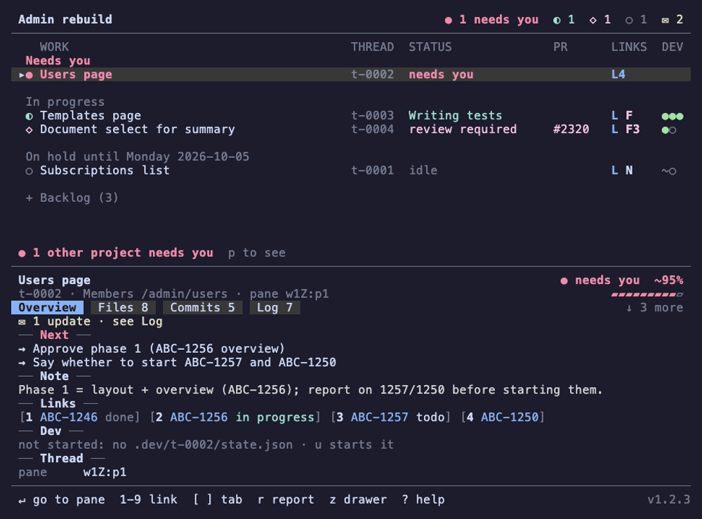

# herdr-deck

[](https://github.com/FredricW/herdr-deck/actions/workflows/ci.yml)

A status pane for [herdr-projects](https://github.com/eliasstravik/herdr-projects):
a Go + Charm TUI that runs in a split next to a project's coordinator and shows
its tasks, threads and their status, Linear / Notion / Figma / GitHub links and
running dev servers.

The deck reads a project's files, thread list, herdr's live state and each
worktree's dev servers, and refreshes as they change. As a herdr plugin it
opens next to each coordinator by itself. See [docs/PLAN.md](docs/PLAN.md)
for the plan and milestones.



## Install as a herdr plugin

Needs herdr 0.9.3 or newer, on macOS or Linux.

```sh
herdr plugin install FredricW/herdr-deck --ref v0.2.0   # a release
herdr plugin install FredricW/herdr-deck                # the latest commit on main
```

herdr runs `scripts/build.sh` as the plugin's build step. When the checkout
is exactly the release named by `herdr-plugin.toml`'s `version`, it
downloads that release's prebuilt binary for your machine (darwin or linux,
arm64 or amd64), checks it against the release's `SHA256SUMS`, and installs
it as `bin/herdr-deck`; no Go needed. Any other commit, or a failed download
or check, builds from source instead, which needs Go 1.27 or newer. Set
`HERDR_DECK_BUILD=source` to always build from source.

For local development, link a checkout instead. `link` never builds, so
build first and again after each change:

```sh
make build
herdr plugin link "$PWD"
```

What the plugin does (`herdr-plugin.toml`):

- **Opens a deck next to each coordinator.** When herdr detects an agent
  whose working directory is a project folder (`<root>/<slug>` with a
  `PROJECT.md`, as `herdr-projects open` starts it), a deck opens in a split
  to its right, about 40 % of the width (60–80 columns), without taking the
  focus. A workspace gets one deck: a second coordinator in it, or the same
  one restarting, opens no other. Thread agents run in worktrees or under
  `<slug>/threads/` and never get a deck of their own.
- **Toggle** (`herdr-deck.toggle`) works in three steps. With no deck in
  the focused pane's tab it opens one to the right of the focused pane, any
  pane, and focuses it. With a deck in the tab but the focus elsewhere it
  focuses the deck. On the deck itself it closes the deck, and the focus
  goes back to the pane left of it. The project
  is the one the pane works in: its folder under the projects root, else the
  herdr-projects `hp_project` token on the pane (thread panes have it), else
  `$HERDR_DECK_PROJECT`. Run it with `herdr plugin action invoke
  herdr-deck.toggle`, or bind it to a key in `~/.config/herdr/config.toml`:

  ```toml
  [[keys.command]]
  key = "prefix+d"
  type = "plugin_action"
  command = "herdr-deck.toggle"
  description = "toggle the deck"
  ```

  and reload with `herdr server reload-config`. Pick any free key.
- **Figma links and Linear IDs in any pane** (`herdr-deck.open-link`).
  Ctrl+click a Figma link anywhere in herdr (Ctrl on macOS too) and it opens
  in the Figma desktop app when `figma_desktop = true` is set in the deck's
  config file, else in the browser. herdr only makes http(s) URLs clickable,
  so a bare Linear ID such as `ABC-123` works through a selection instead:
  double-click the ID, then press a key bound to the action, and it opens in
  your `linear_workspace` by the same rules the deck links it. The first
  link or ID in a longer selection opens. Without a workspace nothing opens
  and a herdr notification says why.

  ```toml
  [[keys.command]]
  key = "prefix+l"
  type = "plugin_action"
  command = "herdr-deck.open-link"
  description = "open the selected Linear ID or link"
  ```

The deck marks its pane with the token `herdr_deck=<slug>` (source
`herdr-deck`); that is how the plugin finds it again. `herdr plugin log list
--plugin herdr-deck` shows what the hooks did and why one failed.

To update, run `herdr-deck update` (or `herdr-deck update --check` to only
look). For a GitHub install it asks herdr to reinstall the newest release
tag (`herdr plugin install FredricW/herdr-deck --ref vX.Y.Z --yes`). For a
linked checkout it runs `git pull --ff-only` and rebuilds `bin/herdr-deck`,
but only when the checkout is on origin's default branch with no
uncommitted changes; otherwise it says why and changes nothing. Nothing
updates on its own: the deck only shows `↑ <version>` in its header when
something newer exists (checked at most once an hour, shared by all decks;
a failed check shows only in the `!` sources view). Running decks notice
the new binary within a refresh or two and restart in place, in the same
pane. The first time a deck starts on a newer version, its footer says
`Updated to vX.Y.Z · w what's new` once; `w` shows the changelog
([CHANGELOG.md](CHANGELOG.md), built into the deck). While `↑` shows, `w`
also lists what the newer version brings, read from its CHANGELOG.md (from
GitHub at the newer tag, or `git show` of origin's commit for a linked
checkout); without a network it just leaves that out.


To remove it, `herdr plugin uninstall herdr-deck`, or `herdr plugin unlink
herdr-deck` for a linked checkout, and delete the keybinding.

## Build and run

Needs Go 1.27 or newer.

```sh
make build                              # → bin/herdr-deck
./bin/herdr-deck --project admin-rebuild
make run ARGS="--project admin-rebuild" # build and run
./bin/herdr-deck --fake                 # built-in sample data
./bin/herdr-deck --version              # version and commit
make test                               # go test ./...
make lint                               # golangci-lint if installed, else gofmt + go vet
make demo                               # re-render the README's GIFs
```

`--fake` shows a made-up project and never touches herdr or a projects
root; its worktrees do not exist, so `e` and `d` only say they opened.
`make demo` re-renders the GIFs in `docs/demo` from the `.tape` files there
with [VHS](https://github.com/charmbracelet/vhs) (it needs `vhs`, `ttyd` and
`ffmpeg`); `make demo TAPES=docs/demo/news.tape` renders one. The tapes
run `--fake` with a build stamped `v1.2.3`, a scratch home folder holding
`docs/demo/config.toml`, and a no-op `open` on `PATH`, so no browser starts
and your own config is never read.

`make build` stamps the version from `git describe --tags --always --dirty`;
other builds fall back to the module version and commit Go records.
CI (`.github/workflows/ci.yml`) runs gofmt, `go vet`, `go test -race` and
golangci-lint on Linux and macOS, and `scripts/test-build.sh`, which tests
the plugin's build script against a fake release.

### Releases

Each release on GitHub has a `herdr-deck_<version>_<os>_<arch>.tar.gz` for
darwin and linux on arm64 and amd64, and a `SHA256SUMS` file. To install one
by hand and check it:

```sh
curl -fLO https://github.com/FredricW/herdr-deck/releases/download/v0.2.0/herdr-deck_0.2.0_darwin_arm64.tar.gz
curl -fLO https://github.com/FredricW/herdr-deck/releases/download/v0.2.0/SHA256SUMS
shasum -a 256 --check --ignore-missing SHA256SUMS   # sha256sum --check --ignore-missing on Linux
tar -xzf herdr-deck_0.2.0_darwin_arm64.tar.gz herdr-deck
./herdr-deck --version
```

A checksum guards against a broken download, not against a tampered
release.

Every PR with a user-facing change adds a line to `## [Unreleased]` in
[CHANGELOG.md](CHANGELOG.md) ([Keep a Changelog](https://keepachangelog.com/en/1.1.0/)
style: `### Added`, `### Changed`, `### Fixed`). Write for people who use
the deck, not for reviewers.

To cut a release:

1. In a PR, bump `version` in `herdr-plugin.toml` (say to `0.2.0`), and in
   CHANGELOG.md rename `## [Unreleased]` to `## [0.2.0] - YYYY-MM-DD` (the
   day you tag) with a new, empty `## [Unreleased]` above it. Merge it.
2. Tag the merge commit on main and push the tag:
   `git tag v0.2.0 origin/main && git push origin v0.2.0`.

The tag push runs `.github/workflows/release.yml`: it fails unless the tag
matches the manifest's version and CHANGELOG.md has a section for it
(`scripts/check-version.sh`; CI's version job checks the same on the tag),
then builds the four archives, writes `SHA256SUMS` and creates the GitHub
Release. The release notes are the version's CHANGELOG.md section
(`scripts/release-notes.sh`); a tag the changelog does not cover gets the
list of PRs and commits since the previous tag instead. To try the workflow without publishing,
run it from the Actions tab with `dry_run` on (the default): the archives
and notes are kept as a workflow artifact. Pull requests that change the
release files run that dry run too. Running it by hand with a tag and
`dry_run` off publishes the release of an existing tag that has none.

The project slug comes from, in order:

1. `--project <slug>`;
2. `$HERDR_DECK_PROJECT`;
3. the working directory, when it is `<root>/<slug>` or below it, where
   `<root>` is the projects root (see below).

The slug is per pane, so it has no config-file key.

Bare Linear IDs such as `ABC-123` link into the Linear workspace you set
(`linear_workspace`, below). There is no default: without one, the IDs still
show, but the drawer and the `!` sources view say a workspace must be set,
and opening one says so too. Full Linear URLs always open.

### Linear issue status

With a Linear API key, the drawer shows each issue's state next to its ID:
`1 ABC-123 in progress  2 ABC-124 todo`. Started states are cyan (in
review magenta), triage yellow, and a done or canceled issue is dim as a
whole. The deck asks Linear's GraphQL API for the IDs on screen in one
batch, in the background, and keeps the answers for 3 minutes, so a reload
never waits on the network. When Linear cannot be reached, refuses the key
or rate-limits the deck, the IDs show without a state and the `!` sources
view says why.

The key comes from, in order:

1. `$LINEAR_API_KEY`;
2. `linear_api_key_command` in the config file: a command that prints the
   key, such as 1Password's `op read`.

Create a personal API key in Linear under *Settings → Account → Security &
access*; read access is enough. Then either export it:

```sh
export LINEAR_API_KEY=lin_api_…   # e.g. in your shell's rc file
```

or keep it in 1Password and let the deck read it:

```toml
# ~/.config/herdr-deck/config.toml
linear_api_key_command = "op read op://Private/Linear/credential"
```

Decks the herdr plugin opens do not see your shell's environment, so the
command is the way to give them a key. It runs without a shell, at most
once per deck start (again only after Linear refuses the key it gave), and
is stopped after 30 seconds. The deck keeps the key in memory only: it
never writes it to the config file, logs, the sources view or disk. Put
the key itself in neither the config file nor the command line.

`linear_status = false` (or `HERDR_DECK_LINEAR_STATUS=false`) turns the
statuses off, and the deck then never calls Linear.

The deck reloads when a file in the project folder (or its `threads/`,
`inbox/` or `.state/`) changes, and every `refresh_interval` (5 seconds by
default). It never writes there.

## Configuration

The deck reads `$XDG_CONFIG_HOME/herdr-deck/config.toml`, else
`~/.config/herdr-deck/config.toml` (on macOS too). `--config <path>` or
`$HERDR_DECK_CONFIG` names another file. Decks the herdr plugin opens read
the same file, so settings there reach them even though they do not see your
shell's environment.

Each setting comes from, in order: the command-line flag, the environment
variable, the config file, the built-in default.

```toml
# ~/.config/herdr-deck/config.toml

# Linear workspace that bare IDs such as ABC-123 link into.
linear_workspace = "acme"

# Open Figma links in the Figma desktop app: the deck's keys and clicks,
# and Ctrl+clicked Figma links anywhere in herdr. false opens the browser.
figma_desktop = false

# Show each Linear issue's state next to its ID (needs an API key).
linear_status = true

# A command that prints the Linear API key; $LINEAR_API_KEY wins over it.
# Run without a shell. Never put the key itself in this file.
linear_api_key_command = "op read op://Private/Linear/credential"

# How often the deck reloads when no file change says to; 1s to 10m.
refresh_interval = "5s"

# The herdr-projects root; ~ is your home folder.
projects_root = "~/.herdr-projects"

# Open a web link in a browser tab that already shows it (macOS); see
# "Browser tabs" below.
reuse_browser_tabs = true

# Show "↑ <version>" in the header when a newer deck exists.
update_check = true

# Restart running decks in place when their binary is replaced, e.g. by
# `herdr-deck update`.
auto_restart = true

# What `e` opens a thread's worktree with. {path} is the worktree folder;
# without it the folder is added at the end. Not run through a shell: quote
# arguments with spaces. terminal = true opens it in a new herdr pane below
# the deck, in the worktree, instead of starting a desktop app.
[editor]
command = "code {path}"   # e.g. "zed {path}", "cursor {path}"
terminal = false          # e.g. command = "nvim {path}" with terminal = true

# The diff tool, for showing a thread's changes (`d` in the deck). {path}
# is the worktree, {base} the commit it is compared against (where it
# forked from its base branch), {file} one file; without a file an argument
# that is just {file} is left out, with a "--" right before it. It runs in
# the worktree.
[diff]
command = "hunk diff {base} -- {file}"
terminal = true
```

The Files section's starting view is a top-level key, so it goes above any
table (`d t` switches views for the session without saving):

```toml
diff_view = "list"   # or "tree": the changed files under their folders
```

| Setting | Flag | Environment variable | Default |
|---|---|---|---|
| `linear_workspace` | `--linear-workspace` | `HERDR_DECK_LINEAR_WORKSPACE` | none |
| `figma_desktop` | none | `HERDR_DECK_FIGMA_DESKTOP` | `false` |
| `linear_status` | none | `HERDR_DECK_LINEAR_STATUS` | `true` |
| `linear_api_key_command` | none | (`LINEAR_API_KEY` holds the key itself and wins) | none |
| `refresh_interval` | `--refresh-interval` | `HERDR_DECK_REFRESH_INTERVAL` | `5s` |
| `projects_root` | `--projects-root` | `HERDR_PROJECTS_ROOT` | `~/.herdr-projects` |
| `reuse_browser_tabs` | `--reuse-browser-tabs` | `HERDR_DECK_REUSE_BROWSER_TABS` | `true` |
| `update_check` | `--update-check` | `HERDR_DECK_UPDATE_CHECK` | `true` |
| `auto_restart` | `--auto-restart` | `HERDR_DECK_AUTO_RESTART` | `true` |
| `[editor] command` | `--editor` | `HERDR_DECK_EDITOR` | `code {path}` |
| `[editor] terminal` | `--editor-terminal` | `HERDR_DECK_EDITOR_TERMINAL` | `false` |
| `[diff] command` | `--diff-tool` | `HERDR_DECK_DIFF_TOOL` | `hunk diff {base} -- {file}`, or `git -C {path} diff --merge-base {base} -- {file}` without hunk |
| `[diff] terminal` | `--diff-terminal` | `HERDR_DECK_DIFF_TERMINAL` | `true` |
| `diff_view` | `--diff-view` | `HERDR_DECK_DIFF_VIEW` | `list` |

A command and its `terminal` option go together: the source that gives the
command also decides `terminal` (or one above it does), so `--editor "zed
{path}"` does not open in a pane because the file says `terminal = true` for
nvim. Without a `terminal` value, the editor is a desktop app and the diff
tool a terminal program. A terminal program needs herdr; outside herdr, `e`
and `d` say so in the status line.

The deck does not read `$VISUAL` or `$EDITOR`. To use yours, put it in the
file, e.g. `command = "nvim {path}"` with `terminal = true`.

Press `s` for the settings page: every setting with its effective value and
where it comes from (flag, env, file or default), grouped as above. `↵`
toggles a switch, cycles a choice such as `diff_view`, or edits a value in
place (checked as you type; `esc` cancels, an empty value removes it), and
`x` removes a setting from the file
so the next source decides. Each change is saved to the config file at once,
creating it and its folder when missing. Only the changed line is touched:
comments, key order and keys the deck does not know stay. A setting a flag
or environment variable sets can still be saved, but the page says the
override keeps winning. The running deck applies a change straight away,
except `projects_root`, which needs a restart (the status line says so).
`linear_api_key_command` is edited as a command; the deck never runs it
there or shows the key it prints.


The deck writes this file only from the settings page and never writes
secrets to it. A missing file is fine. A file that does not parse, an unknown key or a bad value
never stops the deck: the `!` sources view lists the problem (the plugin
commands print it to herdr's plugin log), and that setting falls back to
the next source. A bad flag value is an error.

## Browser tabs

On macOS the deck opens a web link by focusing a tab that already shows the
same page, raising its window and bringing the browser forward, and only
opens a new tab when there is none. It does this for the default browser
when that is Chrome, Chromium, Brave, Edge, Vivaldi, Arc or Safari, through
AppleScript (`osascript`). Any other browser (Firefox, for one), a browser
that is not running, or Linux opens a new tab with `open` or `xdg-open`.
Turn it off with `reuse_browser_tabs = false` (or the flag or variable
above).

The same page means:

- Linear: the same workspace and issue ID; the title slug may differ.
- GitHub: the same pull request or issue, whichever of its tabs (files,
  commits, checks) is showing.
- Figma: the same file (or branch), whatever frame is selected. A
  prototype is not the same page as its design file.
- Notion: the same page ID, also when it is open over a database (`?p=`).
- A dev server on `localhost`, `127.0.0.1`, `[::1]` or `*.localhost`: the
  same scheme, host and port, wherever in the app the tab is.
- Anything else: the same URL, ignoring case in the host, a trailing slash
  and the `#fragment`.

A tab showing exactly the link wins over one that only shows the same page,
and the deck does not navigate the tab it focuses. It reads tab URLs only to
compare them; nothing is kept or sent anywhere.

The first time, macOS asks whether your terminal app (the one herdr runs
in) may control the browser. If you refuse, or the question is still open
after 10 seconds, the link opens in a new tab, as it does every time after
a refusal. To change your answer, use System Settings → Privacy & Security
→ Automation, or turn reuse off.

## Dev servers

The deck shows the dev servers of each open thread's worktree: one dot per
server in the list's DEV column (green `●` when something listens on the
port, dim `○` when not), and in the drawer a `Dev` line with each port and an
`Open` line with numbered localhost links. A port is running when a TCP
connect to `127.0.0.1:<port>` or `[::1]:<port>` succeeds within 400 ms. Ports are probed in
parallel and each answer is reused for 2 seconds.

A repository says where its worktrees' ports are in `.herdr-deck/dev.json`.
The deck reads the worktree's own copy, else the one in the repository's main
checkout:

```json
{
  "state": {
    "file": ".dev/$DIRNAME/state.json",
    "ports": { "frontend": "frontend_port", "api": "api_port", "docs": 6060 }
  },
  "links": [
    { "title": "Frontend", "url": "http://localhost:$PORT_frontend", "needs": "frontend" },
    { "title": "API docs", "url": "http://localhost:$PORT_api/docs", "needs": ["api"] }
  ],
  "up": "scripts/dev-up --name $DIRNAME"
}
```

- `state.ports` names the servers, in the order the deck shows them. Each
  maps to the key in the state file that holds its port (a number or a
  numeric string), or to a fixed port number.
- `state.file` is the per-worktree state file your dev scripts write when
  they start the servers, e.g. `{"frontend_port": 5181, "api_port": 8011}`.
  It may use `$DIRNAME` (the worktree's folder name), `$BRANCH`, `$WORKTREE`
  and `$REPO` (absolute paths of the worktree and the main checkout), also as
  `${…}`; write `$$` for a literal `$`. A relative path is under the main checkout. While the file does not
  exist the drawer says the servers are not started.
- `links` are URL templates with `$PORT_<name>` placeholders and the same
  variables. `needs` is the server or servers that must run for the link to
  work (default: the ports the URL uses); a link to a server that is down,
  or has no port yet, shows `○`, and `o` skips it. A link whose URL uses a
  port that is not known yet is left out until it is.
  Without `links`, each server gets `http://localhost:<port>`.
- `up` (optional) is a shell command that starts the worktree's dev
  servers; `u` runs it for the selected thread. It runs in the worktree with
  `/bin/sh -c`, after the deck fills in the same variables as `state.file`
  (values go in as they are, so quote paths that may hold spaces). Every
  other `$` is a mistake the deck reports, so write `$$` for one the shell
  should see (`$$HOME`). The command runs detached, in its own process
  group, so it keeps running when the deck quits or restarts; its output is
  appended to `$XDG_STATE_HOME/herdr-deck/logs/<project>-<thread>.log`, else
  `~/.local/state/herdr-deck/logs/…`. The drawer shows that log and
  `starting…` until every port answers, or `up exited` when the command
  ended with no port answering. `u` does not start it again while a port
  answers or the command it started still runs. Without `up`, `u` says how
  to add one.

When the manifest gives no port for a worktree, the deck falls back to the
herdr workspace token `port` of the workspace opened on that worktree (a
worktree plugin may set it), marked `~` in the list and drawer. A repository
without a manifest is noted in the `!` sources view; a manifest or state file
that cannot be read is listed there as missing, and the rest of the deck
carries on.

## Keys

| Key | Action |
|---|---|
| `j` / `k`, `↓` / `↑` | move; the drawer follows |
| `space` | fold or unfold the list under the cursor (Backlog starts folded) |
| `1`–`9` | open the drawer's numbered link (Figma links in the desktop app with `figma_desktop = true`) |
| `l` `f` `n` `g` | open the row's Linear / Figma / Notion / PR link; with several, pick one with a digit, `a` for all, `d` for the Figma desktop app, the same letter for the first, `esc` to cancel |
| `o` | open the row's first localhost link whose dev server is running |
| `enter` | focus the thread's herdr pane; on an inbox item, its thread's pane, else the coordinator's |
| `e` | open the thread's worktree in the editor (VS Code unless configured) |
| `u` | start the thread's dev servers: the dev manifest's `up` command, detached (see Dev servers) |
| `d` | the thread's changed files: a digit opens that file in the diff tool, `d` again (or `a`, `enter`) the whole diff, `t` switches between list and folder tree, `esc` cancels; with one file, `d` opens the diff right away (see Changed files) |
| `r` | the thread's report, full height |
| `z` | drawer: normal, full height, hidden |
| `pgup` / `pgdn` | scroll the drawer |
| `!` | sources the deck could not read |
| `s` | settings: every setting, its value and source; `↵` edits, toggles or cycles, `x` removes it from the file (see Configuration) |
| `w` | what's new: the changelog, newest first, with the running release marked; with `↑` in the header, also what the newer version brings |
| `?` | all keys |
| `esc` | back to the selected row |
| `q`, `ctrl+c` | quit |


Mouse: click a row to select it, a list heading to fold it, a drawer link to
open it, a changed file to open its diff (its total line for the whole
diff), `! N` for the sources; the wheel moves the list or scrolls the
drawer.

## Changed files

The drawer's Files section lists every file the selected thread changed in
its worktree, with a status letter, line counts and a total line:

```
 Files    5 files +62 -13 vs origin/main
          1 M src/pages/users/UsersPage.tsx     +48 -6
          2 M src/api/users.ts                  +13 -3
          3 A public/empty-state.png            binary
          4 D src/pages/users/OldList.tsx           -4
          5 ? notes.md                    +1 untracked
```

The letter says how the file changed, as `git status` writes it, in the
terminal's own colours so it reads on dark and light themes: `A` added
(green), `M` modified (yellow), `D` deleted (red), `R` renamed (cyan),
`?` untracked (faint green). A binary file's letter is faint. Counts are
`+added` in green and `-deleted` in red; an added or untracked file shows
only `+N` and a deleted file only `-M`.

`d` then `t` switches to a folder tree and back; the chooser stays open,
since the numbers move. The tree puts each file under its folder, folders
first, joins a chain of folders that hold only one folder into one line
(`src/pages/users/`), and shows each folder's summed counts, faint. Files
are numbered 1–9 in the order shown, so digits and clicks open the file on
that line:

```
 Files    5 files +62 -13 vs origin/main
              public/
          1 A   empty-state.png                 binary
              src/                              +61 -13
                api/                             +13 -3
          2 M     users.ts                       +13 -3
                pages/users/                     +48 -10
          3 D     OldList.tsx                        -4
          4 M     UsersPage.tsx                  +48 -6
          5 ?   notes.md                   +1 untracked
```

The deck starts in the list; `diff_view = "tree"` in the config file (or
the settings page, `--diff-view`, `$HERDR_DECK_DIFF_VIEW`) starts it in the
tree. `d t` does not write the file.

The worktree is compared with where it forked from the thread's base
branch (`base` in the thread record, e.g. `origin/main`, else
`origin/HEAD`): `git diff --numstat <merge-base>`, so committed, staged and
unstaged changes count, plus untracked files (`git ls-files --others
--exclude-standard`). Renames show as `old → new` (from `git diff --raw`, which also gives each
file's status), binary files as `binary`. The section lists nine files, one per digit, then `+K more`.

Git runs off the UI, with a 5 s timeout and without taking git's optional
locks, so it never gets in the way of the agent working in the worktree.
It runs when the selection moves to another thread and on every reload
(the refresh interval, or a change in the project folder); an answer is
reused for 2 s. A resolved thread has no Files section, and a missing
worktree or base shows a dim note instead.

`d` opens the diff tool (`[diff]` in the config file, `hunk` by default)
with `{base}` set to the merge-base commit, so it shows the same changes:
a terminal program in a new herdr pane below the deck, in the worktree.
A renamed file opens with its old and new path, so git pairs them. An
untracked file does not open: `git diff` leaves it out until it is added,
and the status line says so; the whole diff leaves it out too.


## Layout

- `cmd/herdr-deck`: flag parsing and wiring.
- `internal/deck`: the plain structs the deck shows (`deck.Snapshot`).
- `internal/source/*`: produces snapshots and never imports the UI.
  `projects` reads herdr-projects' files and thread list, `tasks` parses
  TASKS.md and scrapes links, `herdr` reads herdr's live panes and events,
  `dev` reads dev-server manifests and probes ports, `diff` reads a
  worktree's changed files with git, `live` combines them and
  watches the project folder, `fake` is sample data for tests and `--fake`.
- `internal/config`: finds and reads `config.toml` and resolves each setting
  (flag > environment > file > default).
- `internal/launch`: opens URLs (`open` / `xdg-open`, reusing a browser tab
  on macOS) and runs the editor and diff tool, as desktop apps or in a new
  herdr pane.
- `internal/project`: works out the project slug.
- `internal/plugin`: the herdr plugin's toggle and open-link actions and
  auto-open hook (`herdr-deck plugin toggle|open-link|agent-detected`, run
  by herdr).
- `internal/ui`: the Bubble Tea model; renders a `deck.Snapshot` and nothing else.
  Its rendering is pinned by `internal/ui/testdata/*.golden` (every state at
  60 and 80 columns); `go test ./internal/ui -update` rewrites them.
